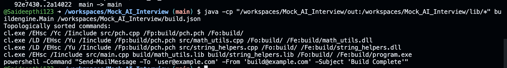

# 🛠 Build Engine Simulation

## Problem Statement

Given a JSON file that specifies build targets and rules, this program simulates a build engine by printing build commands in a valid execution order based on declared dependencies.

### Assumptions
- Any file under `src/` and `include/` already exists.
- Any other input file **must** be produced by exactly one target defined under `"targets"`.
- If dependencies form a cycle, the build must fail.

---

## Example Output

```bash
cl.exe /EHsc /Yc /Iinclude src/pch.cpp /Fp:build/pch.pch /Fo:build/
cl.exe /LD /EHsc /Yu /Iinclude /Fp:build/pch.pch src/math_utils.cpp /Fo:build/ /Fe:build/math_utils.dll
cl.exe /LD /EHsc /Yu /Iinclude /Fp:build/pch.pch src/string_helpers.cpp /Fo:build/ /Fe:build/string_helpers.dll
cl.exe /EHsc /Iinclude src/main.cpp build/math_utils.lib build/string_helpers.lib /Fo:build/ /Fe:build/program.exe
powershell -Command "Send-MailMessage -To 'user@example.com' -From 'build@example.com' -Subject 'Build Complete'"
```

**High level of code** 

1. Parse json into targets 
2. map  files -> producign the target -a. src/, include already existed , any other input must produce exactly one target
3. bulding the dependecy graph , graph : producer -> consumer 
4. Topological sort -> order targets respecting dependencies, 
5. detect cycles and fail

## Code Flow

### Target.java
- Data model representing a single build rule
- Holds:
  - `inputs`
  - `outputs`
  - `command`

---

### DependencyGraphBuilder.java
- Maps output files → producing targets
- Builds the dependency graph (producer → consumer)
- Performs topological sort
- Detects cycles and invalid configurations

---

### Main.java
- Entry point of the program
- Reads the JSON file
- Builds the dependency graph
- Prints build commands in execution order

---

##Code output## :




